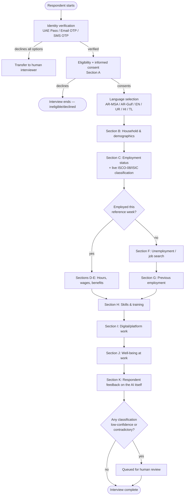
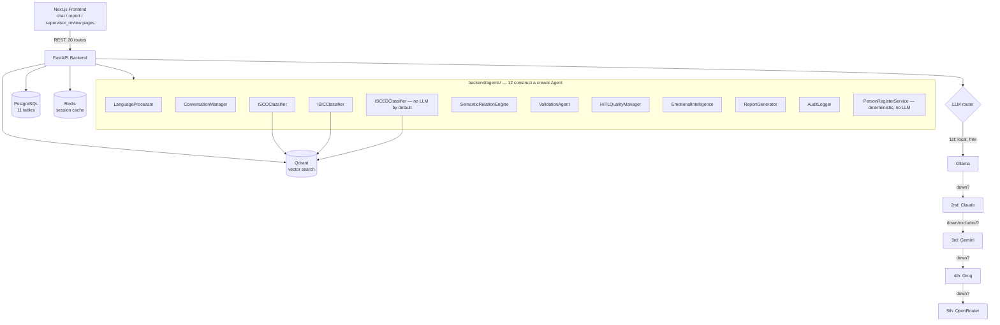

# Multilingual Conversational AI for Labour Force Surveys

**Project Documentation — Business & Technical**
M.Tech Thesis · IIIT Kottayam · Supervisor: Dr. Goutam Mali
**Last updated: 2026-08-24, against commit `18244c6`.**

This is a **self-contained** description of the project, written so a
reader with no prior context — a business stakeholder, a technical
reviewer, or your supervisor — can understand what was built, why, and
how, without needing to open any other file. Part I covers the business
side (the problem, the survey instrument, the workflow). Part II covers
the technical side (architecture, methodology, results). Part III is
current status. A short pointer section at the very end tells you where
to go for deeper detail on any one topic — that is the *only* place this
document defers elsewhere; everything else here stands on its own.

**Maintenance rule**: when a real result, fix, or decision changes
something below, edit it in place here. Do not create a second tracking
file — that fragmentation is exactly what this document replaced.

---

# Part I — Business Documentation

## 1. The problem

National Labour Force Surveys (LFS) are how governments measure
employment, unemployment, wages, and working conditions — the numbers
behind headline economic indicators. The standard method is a
**face-to-face interview**, conducted in-person by a trained human
enumerator, typically taking 25–35 minutes per respondent.

This is expensive and slow to scale, and in a multilingual population —
the UAE's resident workforce spans Arabic, English, Urdu, Hindi, and
Tagalog speakers, among others — it also requires enough interviewers
fluent in each language to avoid systematically under-surveying
non-Arabic, non-English speaking residents. Occupation, industry, and
education coding (assigning a free-text answer like *"I fix car engines
at a garage in Sharjah"* to the correct standardized code) is also a
skilled, time-consuming task traditionally done by trained human coders
after the interview, introducing further cost, delay, and inter-coder
inconsistency.

## 2. The proposed solution

A **conversational AI system** that conducts the LFS interview directly
with the respondent, in their own language, and **classifies their
answers to international statistical standards in real time** — instead
of collecting free text for a human coder to process later. Low-
confidence classifications, contradictions, and distressed respondents
are escalated to a human reviewer rather than silently accepted — this
is a human-in-the-loop (HITL) system, not a fully autonomous one.

**Reference standards used** (all real, published, international):

| Standard | Governs | Published by |
|---|---|---|
| ILO ICLS-19 | The employment/unemployment/labour-force concepts themselves | International Labour Organization |
| ISCO-08 | Occupation coding (4-digit) | ILO |
| ISIC Rev.4 | Industry/economic-activity coding (4-digit) | UN Statistics Division |
| ISCED 2011 / ISCED-F 2013 | Education level and field of study coding | UNESCO Institute for Statistics |

## 3. Objectives

1. Reduce interview duration and cost relative to face-to-face administration.
2. Serve respondents in their own language, including Gulf Arabic dialect, not only Modern Standard Arabic.
3. Classify occupation/industry/education automatically, at the point of interview, instead of via after-the-fact human coding.
4. Never let automation silently produce a wrong or contradictory result — escalate uncertainty to a human.
5. Produce evidence, not assumptions, about whether AI-driven classification is actually accurate enough to be useful, and where it isn't.

**Objective 5 is the thesis's real center of gravity.** Objectives 1–4
describe the system that was built; objective 5 is what was rigorously
measured about it, including negative results (see Part II §10).

## 4. Who this is for (stakeholders)

| Stakeholder | Interest |
|---|---|
| National statistics offices (modeled on SCAD Abu Dhabi, Dubai Statistics Center, FCSA) | Lower-cost, faster, multilingual LFS data collection |
| Survey respondents | A shorter, self-paced interview in their own language, with a human-interviewer option always available |
| Human reviewers (HITL) | A queue of genuinely uncertain cases, not a firehose of everything |
| Academic reviewers (this thesis's examiners/conference reviewers) | Rigorous, honest, reproducible evaluation of the AI methodology |

## 5. The survey instrument

The questionnaire (`Documentation/Questionaries/questionnaire_text.txt`
has the complete text, including bilingual Arabic/English wording and
exact skip logic) has **11 sections**, modeled on the real UAE LFS and
ILO's model LFS design:

| § | Section | Captures |
|---|---|---|
| A | Authentication & Informed Consent | Identity verification, data-use consent, language selection |
| B | Household Roster & Demographics | Gender, DOB, nationality, marital status, education level/field, residence, housing |
| C | Current Employment Status | ILO reference-week employment status; **occupation title → ISCO-08** here |
| D | Working Hours & Conditions | Actual/usual hours, multiple jobs, contract type, remote work |
| E | Wages, Income & Benefits | Net monthly wage, allowances, bonuses, health insurance, pension |
| F | Unemployment & Job Search | ILO's 3-criterion unemployment test (without work / available / actively searching) |
| G | Previous Employment History | Last job, sector, reason for leaving (for the currently non-employed) |
| H | Skills, Training & Emiratization | Skill self-assessment, training uptake, national-employment-program registration |
| I | Digital Work & Platform Economy | Gig/platform work, remote work for foreign employers |
| J | Quality of Work & Well-being | Job satisfaction, safety, harassment/discrimination (ILO SDG-8 decent-work indicators) |
| K | System Quality & Respondent Feedback | Was the AI interview clear? Would the respondent have preferred a human? |

**Skip logic is real and conditional**, not a flat form — e.g. Section D
(hours/conditions) is only asked of respondents who reported being
employed in Section C; Section E's wage questions only apply to paid
employees; Section G (previous employment) only applies to respondents
who have worked before but aren't currently employed.

**Three free-text questions drive the AI classification work this
thesis evaluates**: C5 ("What is your main job title?") → ISCO-08; C6
("What is your establishment's economic activity?") → ISIC Rev.4; B6
("What was your main field of study?") → ISCED-F 2013. Education
**level** (B5) is a closed multiple-choice question, not free text, so
it does not need RAG classification — it maps directly to an ISCED 2011
level.

Estimated duration: **17–25 minutes AI-administered vs. 25–35 minutes
traditional face-to-face** — a real, if modest, business case for time
savings even before accuracy is considered.

## 6. Respondent journey (business workflow)

**At any point**, the respondent can ask for a human interviewer instead
of the AI, and a request to withdraw consent immediately terminates the
interview and deletes the collected data (Appendix B of the
questionnaire document; enforced in code, see Part II §7).

## 7. Data confidentiality & governance

Consent and data handling are framed explicitly around the **UAE Federal
Statistics Law** in the questionnaire's own wording — individual
responses are for statistical purposes only, never individually
disclosed. In the implemented system, this is backed by: an
insert-only audit log (`audit_logs` — never updated or deleted), a
separate `data_access_logs` table tracking who accessed what, and
OTP-based authentication rather than storing passwords.

---

# Part II — Technical Documentation

## 8. Technology stack

| Layer | Technology |
|---|---|
| Backend framework | FastAPI (Python) |
| Agent orchestration | CrewAI |
| Frontend | Next.js 14 (React) |
| Relational database | PostgreSQL 15, via SQLAlchemy + Alembic migrations |
| Session/cache store | Redis 7 |
| Vector database | Qdrant |
| Local LLM runtime | Ollama (`llama3.2`, `gemma3:4b`, tested alternatives `qwen2.5:3b`) |
| Cloud LLM providers | Anthropic Claude 3.5 Sonnet, Google Gemini, Groq, OpenRouter — all opt-in, fail-closed if unconfigured |
| Embedding model | `intfloat/multilingual-e5-small` (default, 384-dim) / `multilingual-e5-large` (1024-dim, evaluated, not yet default) |
| Containerization | Docker Compose (infra services); backend/frontend run natively in development |
| Testing | pytest (2,376 tests as of this document's date) |

**Why this stack, briefly**: FastAPI + CrewAI gives typed, testable agent
boundaries without committing to a heavyweight orchestration framework
this project doesn't actually use (see §9 — CrewAI's *hierarchical
delegation* feature is deliberately not used anywhere). Qdrant was
chosen for vector search because it runs locally with no paid tier,
important given this project's zero-budget cloud constraint. Ollama as
the default LLM keeps the system runnable with no API cost at all; cloud
providers are additive, not required.

### 8.1 LLM routing — local first, automatic cloud fallback

Two distinct, deliberately different contracts exist side by side:

- **`get_llm_strict(model)`** — pins to exactly one named model, no
  substitution ever. Used by the evaluation harness, where every case in
  a run must be answered by the same, known model or the run's accuracy
  number describes a system that never actually existed end-to-end.
- **`get_llm(TaskType.GENERAL)`** — used by the live conversational
  agents (ConversationManager, LanguageProcessor, EmotionalIntelligence)
  and by default classifier construction. Tries providers **in this
  fixed order, automatically**, stopping at the first one that's
  actually usable:

  **Ollama (local, free) → Claude → Gemini → Groq → OpenRouter**

  This is a real fallback chain, not just a description — if Ollama is
  down, it moves to Claude; if that's unavailable (or excluded, see
  below), Gemini; and so on. Which provider actually answered is always
  recorded (`resolved_provider`, `attempted_providers`,
  `failure_reasons`), never silently ambiguous.

  **One real limitation, disclosed rather than hidden**: this check is
  construction-time only — "is the API key present" — not a live
  liveness probe, because probing every cloud provider on every call
  would itself burn real API quota (Gemini's free tier is ~20
  requests/day). A key can be present and syntactically valid while the
  account has zero credit, which only surfaces when the model is
  actually invoked, not when it's constructed. This project's own
  Anthropic key is exactly that case — present, but zero usable credit —
  so it's explicitly excluded via `LLM_FALLBACK_EXCLUDE=anthropic` in
  `.env`, and the chain goes straight to Gemini instead of reaching
  Claude and failing later. 10 tests cover this behaviour.

## 9. System architecture

**Important correction versus older planning documents**: earlier
project drafts described a "10-agent CrewAI system" with
`Process.hierarchical` and a manager agent delegating to workers. **That
architecture was never built.** The real system has 12 modules that
construct a `crewai.Agent` (all with `allow_delegation=False`), called
directly by orchestration code (`backend/api/survey_routes.py`) — never
through CrewAI's own delegation mechanism. If you see a reference to
"Agent 1" through "Agent 10" in an older document (including the
questionnaire's own Appendix B), treat it as a **design-time role name**,
not a literal numbered class — the mapping to the real modules is:

| Old design-time role | Real implementing module |
|---|---|
| Agent 1 — Auth | `backend/api/auth_routes.py` (OTP-based, no dedicated "agent") |
| Agent 2 — Dialogue Manager | `ConversationManager` |
| Agent 3 — Language | `LanguageProcessor` |
| Agent 5 — RAG classification | `ISCOClassifier` / `ISICClassifier` / `ISCEDClassifier` |
| Agent 6 — Emotional Intelligence | `EmotionalIntelligence` |
| Agent 7 — Validation | `ValidationAgent` |
| Agent 9 — HITL | `HITLQualityManager` + the `hitl_queue` table |
| Agent 10 — Audit | `AuditLogger` |

## 10. Classification methodology — the core technical contribution

### 10.1 Retrieval-augmented classification (RAG)

Each free-text answer (job title, industry description, field of study)
is embedded and matched against a Qdrant collection of the target
standard's codes, either:

- **Flat retrieval** — one direct similarity search against all leaf
  codes (e.g. all 436 ISCO-08 unit groups at once), or
- **Hierarchical retrieval** — a 4-stage beam search that narrows major
  → sub-major → minor → unit group step by step, filtering each stage's
  candidates by the previous stage's winning parent.

Both use the same generic `HierarchyBeamSearchEngine` — hierarchical
retrieval is not a separate algorithm, just a different configuration of
the same engine (stage count, collection names, per-stage weights).

Below a confidence threshold, an **optional LLM re-ranking step** can
run: the top-K retrieved candidates are shown to an LLM, which picks the
single best match. This is opt-in per classifier instance and, as of
2026-08-24, available for all three standards (ISCO, ISIC, ISCED-F),
each with the same fail-closed provider contract (§8).

### 10.2 Semantic Relation Engine (SRE)

A fourth, cross-cutting component checks whether the three
classifications (occupation, industry, education) are **mutually
plausible** — e.g. an ISCO-08 "Medical Doctor" classification paired
with an ISCED 2011 education level below tertiary is flagged. Violations
are scored into three severity bands (LOW/MODERATE/HIGH); HIGH-severity
results escalate to the live HITL queue.

### 10.3 Human-in-the-loop (HITL) escalation

| Trigger | Threshold | Escalates via |
|---|---|---|
| ISCO-08 classification confidence | < 0.70 | `HITLQualityManager` |
| SRE severity | HIGH | `HITLQualityManager` (verified wired into the live message endpoint) |
| Validation rule flags | ≥ 2 | `ValidationAgent` |
| Emotional distress detected | high-distress signal | `EmotionalIntelligence` |
| Random quality-control sample | 5–10% | `HITLQualityManager` |

## 11. Evaluation methodology

Real-world respondent data does not yet exist for this project (the
pilot has not run — see Part III). Controlled evaluation instead uses
**WISCO v2**: an externally published, CC-BY-4.0, DOI-anchored
(`10.5281/zenodo.8262593`) dataset of 20,760 multilingual occupation
titles with gold ISCO-08 codes — not LFS data, but real, independently
labelled, and large enough for statistically meaningful comparisons.
Evaluation uses a fixed, group-aware, leakage-audited 2,013-case
dev / 18,747-case heldout split.

**Statistical methods used throughout**: exact accuracy with Wilson 95%
confidence intervals, Cohen's κ for agreement, and McNemar's exact test
for paired accuracy comparisons (the standard test for "did method A
beat method B on the *same* cases," not just aggregate accuracy).

### 11.1 In progress: a genuine 3-way split (dev / validation / heldout)

**Where this idea came from**: you shared a detailed benchmark-design
template (scenario families, 5-language leakage-safe splitting,
dev/validation/heldout, frozen-config discipline). That exact template
doesn't match this system (it's built for a document-grounded QA system,
this is a classification system — full comparison in the conversation
this was discussed in), but its *underlying principles* are sound and
partly already true here. This subsection is where that idea lives now,
connected to what already exists, so it doesn't float disconnected from
the rest of the project.

**What already exists that satisfies this template's real intent**
(§11 above): WISCO v2's split is already grouped, not per-case —
`eval/build_wisco_isco_benchmark_v2_group_split.py` union-find-merges
WISCO occupation keys into families whenever two keys share
byte-identical normalized title text in *any* language, then assigns
each whole family to one split via a fixed-seed hash. This is the exact
same principle as the template's "keep all 5 language versions of a
scenario in the same split," just derived from real title duplication
instead of hand-authored scenarios — and it's audited (v1→v2 fixed 4
real cross-split leakage groups the naive per-key split missed).

**What's genuinely missing, and being built now**: today's split is
2-way (`dev`: 2,013 cases, `purpose: parameter selection only`,
`frozen: false`; `heldout`: 18,747 cases, `purpose: frozen confirmation
set`, `frozen: true` — see `split_manifest.json`). The template's
3-way dev/validation/heldout structure is real and worth having:
carving a genuine **validation** split out of the current 2,013-case
dev pool (same union-find grouping, so it's leakage-safe by the same
proof already audited), so config selection (flat vs. hierarchical,
e5-small vs. e5-large, reranker thresholds) has a proper validation set
instead of eyeballing dev directly.

**One honest methodological note, stated plainly for the thesis**: the
heldout split has already been read twice — the canonical flat/
hierarchical result (§12 rows 2–3, one run, two arms) and the e5-large
confirmation (§12 row 4, completed 2026-08-24: +8.50pp, McNemar
p≈7.34×10⁻¹⁶⁷). This is legitimate
as a **controlled comparison study** (each comparison was a single,
pre-decided architectural question — flat vs. hierarchical, e5-small vs.
e5-large — not a hyperparameter search that tried many configs and kept
the best), but it is *not* the same as a "never touched until final
report" test set in the strict ML sense. Once the validation split above
exists, that distinction gets cleaner going forward: any *new* config
exploration uses dev+validation only, and the heldout set gets one
single confirmatory reading per finalized comparison — same discipline
the template asked for, applied honestly to what this system actually
is.

**Status: built, verified, real.** `eval/build_wisco_isco_benchmark_v3_dev_validation_split.py`
reuses v2's own `build_groups()`/`_split_for_group()` verbatim (imported,
not reimplemented) for the dev-vs-heldout decision, and only applies a
second, independently-seeded hash decision to groups v2 already put in
dev, splitting them further into dev/validation.

| Split | Cases | Purpose | Frozen? |
|---|---:|---|---|
| Dev | 1,371 | Exploratory parameter selection | No |
| Validation | 642 | Final config selection, one look before heldout | No |
| Heldout | 18,747 | Confirmation only | Yes — **unchanged** |

**The load-bearing correctness check**: heldout's benchmark-ID set was
diffed against v2's heldout — `symmetric_difference_count: 0`, and a
direct `diff` of the exported CSVs confirms byte-for-byte identical
content, not just a matching count. Also verified: zero cross-split
leakage (reused the same audit v2 was checked with), 0 schema validation
errors, and Validation is ≈32% of the dev pool (642 of 2,013) — close to
the ~30% targeted, chosen deliberately rather than copied from the
original template's 60/20/20 (which assumed a total-population ratio
this project's already-fixed, already-audited 10%/90% dev/heldout split
doesn't have).

**One real bug found and fixed while building this, not routed around**:
`audit_wisco_benchmark_leakage.py`'s code-distribution check used a
hardcoded `{"dev", "heldout", "excluded"}` dict and raised `KeyError` the
moment a `"validation"` record hit it. Root-caused and fixed to a
`defaultdict(Counter)` that works for any split the schema allows, not
patched around. Same fix pattern applied to `eval/ablation_runner.py`'s
output-directory routing, which would otherwise have silently written
validation-derived results into the directory reserved for citable
confirmed results. 9 new tests across both fixes (2 for the routing fix,
7 for the split-builder itself, including a synthetic-data test that
proves group integrity — two source keys sharing identical text always
land in the same split, never split apart).

Real output: `eval/local_benchmarks/wisco_isco08_v3_dev_validation_split/`
(`records.json`, `split_manifest.json`, `build_summary.json`, and
`dev`/`validation`/`heldout` CSVs in `run_eval.py` format). v2's own
files are untouched — this is additive, not a replacement.

**Not yet done**: no config selection has actually been run against the
new validation split yet (e.g., re-checking flat vs. hierarchical, or
e5-small vs. e5-large, using validation instead of eyeballing dev) — the
split exists and is verified; using it is the next step.

## 12. Results — every ISCO-08 accuracy experiment run, in one table

Every configuration actually tested, chronologically, with real sample
sizes and validity status stated explicitly — nothing tested is omitted,
and nothing invalid is presented as if it were usable evidence:

| # | Configuration | n | Accuracy | Status |
|---|---|---:|---:|---|
| 1 | BM25 (keyword-only baseline) | 63 | 3.17% | Valid — 0% on 3 of 5 languages, not viable for multilingual use alone |
| 2 | **Flat retrieval, no reranking, e5-small** (canonical) | **18,747** | **21.19%** | Valid — the original headline, published result |
| 3 | **Strict hierarchical retrieval, no reranking** (canonical) | **18,747** | **10.35%** | Valid — 10.84pp worse than #2, McNemar p≈1.86×10⁻³⁰¹ |
| 4 | **Flat retrieval, no reranking, e5-large** (full-scale confirmation) | **18,747** | **29.70%** | Valid — **+8.50pp over row 2 on the identical 18,747 cases**, McNemar p≈7.34×10⁻¹⁶⁷, 95% CI [29.05%,30.35%] non-overlapping with row 2's [20.61%,21.78%]. This is now the headline retrieval-quality result. |
| 5 | Flat retrieval, no reranking (small subsample, e5-small) | 63 | 20.63% | Valid — same method as row 2, smaller sample; baseline for rows 6–8 below |
| 6 | Flat + reranker: local `llama3.2` | 63 | 20.63% | Valid — **identical right/wrong set to row 5** (no rerank at all) |
| 7 | Flat + reranker: `gemini-3.6-flash` (cloud) | 63 | 20.63% | Valid — **identical right/wrong set to rows 5 and 6**, 13/63 correct in all three, case for case |
| 8 | Flat + **corrective RAG retry** (gap-aware accept rule) | 63 | 23.81% | Valid at this scale; the one config on the 63-case sample that moved the number at all — but within run-to-run noise given n=63 |
| 9 | Flat + reranker: `aya:latest` (8B, local) | 20 | 15.0% | **Invalid** — 7.6 timeouts/case, this machine's hardware couldn't run it reliably; not a finding about the model |
| 10 | Flat + e5-large embeddings, no reranking (preliminary 500-case sample) | 500 | 29.20% | Valid, **superseded in scale by row 4** — the 500-case estimate (+8.6pp) held up almost exactly at full scale (+8.50pp) |
| 11 | Flat + e5-large + reranker: `groq/gpt-oss-120b` | 500 | 29.20% | Valid — **byte-identical to row 10**, 499/500 predictions matched exactly, reranker fired on 100% of cases and changed nothing |
| 12 | Flat + e5-large + corrective retry + gap-aware confidence, reranker: Gemini | 300 | 21.00% | **Invalid** — Gemini's free-tier daily quota (20 requests/day) was exhausted after ~20 cases; the remaining ~280 silently fell back to unreranked retrieval, so this number is not a real reranked measurement |

**Per-language, row 4 vs. row 2 (full 18,747 heldout, exact per-case pairing)** —
the real story is sharper than the aggregate number:

| Language | n | e5-small | e5-large | Gain |
|---|---:|---:|---:|---:|
| Arabic | 3,762 | 14.62% | 28.84% | **+14.22pp** |
| English | 3,818 | 37.98% | 37.59% | −0.39pp (not meaningful — within noise) |
| Hindi | 3,793 | 23.07% | 30.95% | +7.88pp |
| Tagalog | 3,766 | 14.47% | 24.19% | +9.72pp |
| Urdu | 3,608 | 15.33% | 26.66% | **+11.34pp** |

English is flat. **Every other language gained substantially, led by
Arabic more than doubling.** The full-scale run makes this cleaner than
the 500-case sample could show: the improvement isn't spread evenly, and
it isn't inflated by the language that was already strongest — it's
concentrated almost entirely in the four languages that needed it most.

**The methodological finding, stated once, clearly**: rows 5→6→7 show
reranker choice (none, local, cloud) makes **zero** difference — 13/63
correct in all three, case for case. Rows 10→11 repeat that exact null
result on a stronger retrieval base with a different provider, at n=500.
Row 8 (corrective retry) is the one config that moved the 63-case number
at all, though not enough to trust past the noise at that sample size.
Row 2 vs. 3 shows the retrieval *architecture* choice (flat vs.
hierarchical) matters a great deal; **row 4 vs. row 2 — now confirmed at
the identical full 18,747-case scale as the original canonical
result — shows the *embedding model* choice matters just as much, if not
more.** **Conclusion: retrieval quality is the accuracy ceiling for this
pipeline — reasoning-layer changes (which reranker, whether to retry)
don't raise it; retrieval-layer changes (architecture, embedding model)
do.** This is the thesis's sharpest, best-evidenced technical
contribution — not the raw accuracy number itself. **Never describe
hierarchical retrieval as outperforming flat, and never cite row 12's
21.00% as a valid reranked-e5-large result — both are explicit
"do not cite" items.**

### 12.3 Other validated results

- **SRE**: 61-case validation, 0 mismatches between predicted and actual
  severity; HIGH-severity escalation to the live HITL queue verified 3×
  against the real API endpoint (100%/15 HIGH escalated, 0%/46 non-HIGH,
  byte-identical across runs).
- **Computational efficiency**: hierarchical RAG 133.9ms mean latency,
  flat 31.1ms; single-instance load test survives 42 concurrent users at
  100% success, fails at 50.
- **LLM tier-routing (which local model to use for conversational
  tasks)**: `qwen2.5:3b` matches or beats `llama3.2` on every tested
  agent, most clearly on Arabic-script NER. Not yet switched in
  production — a measurement, not a decision.

## 13. Data model & API surface

**Database**: PostgreSQL, 11 tables — `users`, `otp_codes`,
`survey_sessions`, `survey_responses`, `audit_logs`, `data_access_logs`,
`agent_decision_logs`, `quality_reviews`, `hitl_queue`,
`person_register`, `survey_report_records`.

**API**: FastAPI, 20 routes (corrected 2026-08-24 from a previously-
stated 17 — undercounted against `CLAUDE.md`'s own already-listed
20-line route table; re-verified directly against the live route
decorators in `backend/api/`) covering auth (OTP request/verify by
email/SMS), survey session CRUD, message exchange, response
retrieval/correction, report generation, the HITL queue/review
endpoints, and health/readiness/debug utility routes. Full route list
and request/response shapes: interactive Swagger UI at `/docs` on a
running instance.

## 14. Security & privacy implementation

- Authentication via one-time passcodes (email/SMS), never a stored
  password.
- `audit_logs`: insert-only, every agent decision logged with input,
  output, and confidence — never updated or deleted.
- `data_access_logs`: a separate, dedicated log of who accessed
  respondent data, distinct from the decision audit trail.
- Consent withdrawal mid-survey is designed to immediately terminate the
  session and delete collected data (per the questionnaire's Appendix B
  specification).

## 15. Testing

2,376 tests pass as of this document's date (`pytest backend/tests
eval/ -q`), covering agent logic, the RAG retrieval engine, database
models, API routes, and the evaluation harness itself. Tests are
hermetic — no live Qdrant/Ollama/network dependency in the default
suite; live-service behavior is verified separately via direct,
documented smoke tests against a running instance. **Re-verified live
2026-08-24 against a fresh `pytest --collect-only` run** (as part of a
documentation-completeness audit prompted by a direct question — "is
everything properly documented" — not routine maintenance): this 2,376
figure is confirmed correct — originally 1,535 `backend/tests` + 841
`eval/`, 98 files; after the same-day reorganization in §15.1 below moved
one 16-test file, now **1,519 `backend/tests` + 857 `eval/`**, grand
total unchanged. `CLAUDE.md`'s own Testing section had drifted to a
stale 2,282 (dated 2026-08-21, before the corrective-retry port and
3-way split work added new tests) and has been corrected to match.

### 15.1 `backend/evaluation/` was found undocumented, then moved to `eval/legacy_thesis_ch6/`

Everything above (and everywhere else in this document) describes the
`eval/` harness at the repo root. A separate, real, importable module
used to live at `backend/evaluation/evaluate.py` ("Thesis Chapter 6"
framework — BM25 / flat-vector / hierarchical-RAG comparison over a
100-item **synthetic** corpus, predates `eval/`) — found completely
undocumented in both this file and `CLAUDE.md` during the 2026-08-24
audit that prompted this subsection. Rather than just documenting the
split, it was resolved the same day: `grep` confirmed **zero real
production coupling** (only one test file imported it, nothing in
`backend/agents/`, `backend/api/`, or `backend/rag/` did), so the whole
module — `evaluate.py`, `run_comparison.py`, `semantic_demo.py`, the
`wisco/` WISCO-parsing pipeline, and its test file — moved to
**`eval/legacy_thesis_ch6/`**, alongside every other evaluation-only
module. The dozen `eval/*.py` scripts that used to write their output
JSON/CSV into `backend/evaluation/` now write to
**`eval/results/legacy_thesis_ch6/`** instead, matching `eval/results/`'s
existing convention. Verified via a real `pytest --collect-only` (all
imports resolve, same 2,376 total) and a real, non-collect-only run of
the directly affected tests (45 passed). The authoritative "which
subsystem's numbers to cite" rule is unaffected by the move and remains
in `Documentation/Conference_I_Reviewer_2/EVALUATION_PROTOCOL.md`: every
number in this document comes from `eval/`'s main harness, never from
`eval/legacy_thesis_ch6/evaluate.py`'s synthetic-corpus comparison.

---

# Part III — Status & Roadmap

## 16. What's done, what isn't

| Area | Status |
|---|---|
| Core conversational survey flow (11 sections, skip logic, multilingual) | Built and tested |
| ISCO-08 classification (flat + hierarchical + optional reranking) | Built, tested, **evaluated at scale** (§12, rows 2–3) |
| ISIC Rev.4 / ISCED-F 2013 classification | Built and tested; hierarchical retrieval live since 2026-08-23; corrective-retry parity with ISCO-08 added 2026-08-24; a real non-determinism bug in the keyword scorers found and fixed the same day (below); **accuracy not yet evaluated** against a labelled test set; catalogue coverage is 134/419 ISIC classes and 63/~80 ISCED-F fields |
| Semantic Relation Engine (cross-standard consistency) | Built, tested, validated (§12.3) |
| HITL escalation | Built, wired into the live API, verified (§12.3) |
| Local-first, automatic cloud-fallback LLM routing | Built and tested (§8.1) — 2026-08-24 |
| Real-world pilot (n=30, the actual planned field validation) | **Not started.** No ethics application submitted. This is not a coding task and is the single highest-priority open item in the project. |
| CrewAI orchestration-correctness evaluation | **Not started.** |
| Real Claude 3.5 Sonnet cost/latency measurement | Not obtained — every attempt so far has hit zero API credit. |
| Full-scale WISCO evaluation, e5-large retrieval, no reranking | **Done, 2026-08-24** — full 18,747-case heldout, +8.50pp over e5-small (§12 row 4) |
| Full-scale WISCO evaluation with reranking enabled | Still not run at full 18,747-case scale (500-case samples exist; see §12, rows 10–11) — blocked by real API rate limits, not effort; see §12's reranking-null-result, already proven at n=500 on the stronger retrieval base |

### 16.1 A real production non-determinism bug, found and fixed

While porting corrective retry to ISIC/ISCED (mirroring ISCO-08's
existing implementation — see below), a test that should have been
completely deterministic failed intermittently. Chasing it down found a
genuine bug, not a test artifact: `ISCEDClassifier`'s level/field scorers
and `ISICClassifier`'s keyword scorer all tokenised query text via
`set(re.findall(...))`. A Python `set`'s iteration order depends on
`PYTHONHASHSEED`, which is **randomised by default every time a Python
process starts**. Whenever two candidates tied on keyword-hit count —
common, given the integer-count scoring (e.g. "bachelor," ISCED level 6,
and "education," level 0 via the level-0 keyword string's own tokenised
"no education," both hitting once for a real input) — the tie-break
silently depended on which token the hash-randomised set happened to
iterate first. **Confirmed directly**: the identical input text
classified to a different ISCED level across different `PYTHONHASHSEED`
values (tested 0 through 6) — meaning **the same respondent answer could
classify differently depending on which server process handled it**, a
real correctness bug, not a benchmark-only concern. `ISCOClassifier` was
never affected — its own keyword-hint function already iterated
`re.findall()`'s list directly rather than wrapping it in `set()`, which
is exactly what pointed to the fix: switch to `dict.fromkeys(re.findall(
...))`, which dedupes while preserving each token's real first-
appearance order in the source text. Deterministic, and a more
defensible tie-break rule than an arbitrary hash. 5 new regression
tests, including one that inspects the fixed functions' own source to
guard against this exact bug being reintroduced by a future refactor.

**Corrective retry, ported the same day**: `ISICClassifier`/
`ISCEDClassifier` gained `enable_corrective_retry`, mirroring
`ISCOClassifier`'s exactly (same gap-based accept rule — a retry
replaces the original only if it produces a strictly wider top1/top2
candidate-score gap, never on raw confidence alone). ISCED's retry is
scoped to the field dimension only; level stays deterministic. Default
`False`, zero behavioural change for existing callers. This closes the
"same logic across ISCO-08/ISIC/ISCED" gap.

## 17. Open decisions for you and your supervisor

1. **Production default: flat vs. hierarchical retrieval.** Evidence
   favors flat (§12, rows 2–3); not yet switched.
2. **Production default: e5-small vs. e5-large embeddings.** Evidence
   favors e5-large **strongly** — now confirmed at the full 18,747-case
   scale (§12 row 4: +8.50pp, McNemar p≈7.34×10⁻¹⁶⁷, non-overlapping 95%
   CIs), not just the earlier 500-case sample — at ~7× query latency cost
   (202ms vs. 28ms, both still fast in absolute terms); not yet switched.
3. **Thesis framing.** Given the real accuracy numbers, the strongest
   framing is methodology-first ("a rigorous comparative study of RAG
   design choices, with a genuine negative result on hierarchy and a
   genuine positive one on embedding scale") rather than
   accuracy-first ("a system that classifies occupations well"). The
   evidence base supports the first framing far more comfortably.

## 18. Next steps

**Outside code — the one item that actually gates the thesis timeline:**

1. **Submit the Module E ethics application.** Nothing else in this list
   matters as much. Every week this slips, the Weeks 8–12 pilot window
   and everything downstream of it (the only path to a real-LFS
   validation claim) slips with it.

**Inside code — ranked by how directly each moves the thesis forward:**

2. **Decide the two production defaults** (§17, items 1–2) — flat vs.
   hierarchical, e5-small vs. e5-large. Both now have full-scale,
   statistically decisive evidence (§12 rows 2–4); this is purely a
   sign-off, not more measurement.
3. **Use the new validation split (§11.1) for real.** It's built and
   verified but nothing has been run against it yet — the next config
   question (e.g. reranker thresholds, or extending the e5-large upgrade
   to ISIC/ISCED-F) should use it instead of another ad hoc dev-split
   sample.
4. **Evaluate ISIC/ISCED-F accuracy** against a real labelled test set —
   the one major gap in §16's status table. The hierarchical-retrieval
   infrastructure is live; no accuracy number exists yet for it, unlike
   ISCO-08.
5. **Module H (CrewAI orchestration-correctness evaluation)** — the only
   remaining module with zero work started and no external blocker. A
   reasonable next engineering task once 2–4 above are settled.
6. **Refresh `Documentation/Conference_I_Reviewer_2/REVIEWER_RESPONSE_IMPLEMENTATION_MATRIX.md`**
   against everything in §12 and §16 — it's dated 2026-08-10 and predates
   all of this document's newer findings.

**Not recommended as a next step, and why:** chasing a real Claude 3.5
Sonnet reranked result is blocked purely on account credit, not
engineering effort — and §12's rows 6 and 10 already show reranker
choice doesn't move the accuracy number, so a Claude-specific number
would be evidence of cost, not of anything new about accuracy.

## 19. Appendices — the actual questionnaire reference material

Reproduced here in full (not just pointed to) from
`Documentation/Questionaries/questionnaire_text.txt`, since these three
appendices are exactly the material a reviewer needs to judge the
questionnaire design without opening a second file.

### Appendix A — ISCO-08 major group reference

The 1-digit major-group reference the AI agent's hierarchical retrieval
narrows down from:

| Code | Major Group | Examples |
|---:|---|---|
| 1 | Managers | CEO, Director, Minister, General Manager |
| 2 | Professionals | Doctor, Engineer, Lawyer, Teacher, Scientist |
| 3 | Technicians & Associate Professionals | Nurse, Technician, Sales Agent, Police Officer |
| 4 | Clerical Support Workers | Secretary, Data Entry, Cashier, Customer Service |
| 5 | Service & Sales Workers | Cook, Waiter, Security Guard, Retail Salesperson |
| 6 | Skilled Agricultural, Forestry & Fishery Workers | Farmer, Fisher, Forester (rare in UAE context) |
| 7 | Craft & Related Trades Workers | Electrician, Plumber, Carpenter, Welder |
| 8 | Plant & Machine Operators, Assemblers | Driver, Machine Operator, Assembler |
| 9 | Elementary Occupations | Cleaner, Laborer, Helper, Domestic Worker |
| 0 | Armed Forces Occupations | Military officer, Soldier, Police (uniformed) |

### Appendix B — HITL escalation thresholds & routing

The original design-time trigger table (role names translated to real
modules per §9's mapping table):

| Trigger condition | Threshold | Action | Real module |
|---|---|---|---|
| ISCO-08 coding confidence | < 0.70 | Escalate to human coder | `HITLQualityManager` |
| Multiple validation flags | ≥ 2 flags | Flag case; request clarification | `ValidationAgent` |
| Contradictory responses | Logic error detected | Prompt respondent to clarify | `ValidationAgent` |
| Language detection failure | < 0.80 confidence | Switch to multilingual fallback | `LanguageProcessor` |
| Emotional distress detected | High distress signal | Transfer to human interviewer | `EmotionalIntelligence` |
| Random quality check | 5–10% sample | Route for full human review | `HITLQualityManager` |
| Response time | > 90 sec/question | Offer re-phrasing or human option | `ConversationManager` |
| Consent withdrawn mid-survey | Any point | Immediately terminate; delete data | Auth flow |

### Appendix C — Survey variable summary (thesis evaluation variables)

The specific variables this questionnaire was designed to produce for
thesis-level analysis:

| Var | Question | Variable name | Type | Used for |
|---|---|---|---|---|
| V01 | C1 | `employment_status` | Binary | ILO labour force classification |
| V02 | C5 | `isco08_code` | Categorical (4-digit) | ISCO-08 RAG classifier output |
| V03 | C6 | `isic_code` | Categorical (4-digit) | Industry classification |
| V04 | B5 | `isced_level` | Ordinal (0–8) | Education classification |
| V05 | D1 | `actual_hours_worked` | Continuous (hrs) | Underemployment measure |
| V06 | D2 | `usual_hours_worked` | Continuous (hrs) | Employment intensity |
| V07 | E1 | `monthly_net_wage` | Continuous (AED) | Wage inequality analysis |
| V08 | F1 | `job_search_active` | Binary | ILO unemployment criterion |
| V09 | F3 | `available_for_work` | Binary | ILO unemployment criterion |
| V10 | F4 | `unemployment_duration` | Ordinal | Long-term unemployment |
| V11 | K3 | `ai_vs_human_preference` | Ordinal (1–3) | User experience evaluation |
| V12 | K4 | `data_confidence_score` | Likert (1–5) | Trust in AI system |

## 20. Where to go for more detail

This document is self-contained for understanding the project. For
forensic-level detail on any one topic:

| Need | Go to |
|---|---|
| Exact file paths, line numbers, dependency versions | `CLAUDE.md` (repo root) |
| Reviewer-response evidence trail (8-comment tracking) | `Documentation/Conference_I_Reviewer_2/` |
| Full per-language/per-task result tables | `Documentation/Phase_2/FINAL_RESULTS_PACKAGE.md` |
| The complete bilingual (Arabic/English) question-by-question text, incl. exact skip-logic wording | `Documentation/Questionaries/questionnaire_text.txt` — §5 and Appendices A–C above summarize it; this is the full source |
| Setup/run instructions | `README.md` (repo root) |

## 21. Change log

- **2026-08-24 (final update, part 2)** — Ported corrective RAG retry to
  ISIC/ISCED (§16.1), closing the "same logic across ISCO-08/ISIC/ISCED"
  gap. While doing that, found and fixed a real production non-
  determinism bug: ISIC/ISCED's keyword scorers used `set()` for
  tokenisation, whose iteration order is `PYTHONHASHSEED`-dependent —
  confirmed directly that identical input text could classify to a
  different result depending on which server process handled it. Fixed
  to `dict.fromkeys()` (deterministic, order-preserving). 15 new tests
  across both changes; full suite re-run with zero regressions.
- **2026-08-24 (final update)** — The full 18,747-case e5-large heldout
  confirmation finished: **29.70% vs. e5-small's 21.19%, +8.50pp,
  McNemar p≈7.34×10⁻¹⁶⁷**, matching the exact scale of the original
  canonical result, not just a 500-case sample. Per-language breakdown
  recomputed from the real paired data: English is flat (−0.39pp, not
  meaningful); every other language gained substantially, led by Arabic
  more than doubling (14.62%→28.84%, +14.22pp). §12's results table,
  §16's status table, and §17's open decisions all updated with the real
  numbers — this is now the headline, full-scale, statistically decisive
  result for the thesis.
- **2026-08-24 (later still)** — §11.1's validation split is now real,
  not a plan: built, verified byte-identical-heldout against v2, zero
  leakage, 9 new tests added. Found and root-cause-fixed a real
  `KeyError` bug in the shared leakage-audit code (hardcoded split dict,
  not a workaround) and a related silent-miscategorization risk in
  `ablation_runner.py`'s output routing. Full affected-area sweep: 95
  tests passed, 0 failed.
- **2026-08-24 (later same day)** — Added §11.1: a permanent home for
  incorporating your ideas into this document instead of letting them
  live in disconnected conversation — starting with the shared
  benchmark-design template, mapped explicitly onto what already exists
  (WISCO's group-safe split) and what's genuinely missing (a real
  validation split, queued once the current background run finishes).
  **Going forward, any new idea you bring gets added here, in a
  subsection that names what it connects to — this is now the standing
  rule for this document, not a one-off.**
- **2026-08-24** — Added a real, tested, local-first automatic LLM
  fallback chain (Ollama → Claude → Gemini → Groq → OpenRouter — see
  §8.1). Consolidated every ISCO-08 accuracy experiment (including
  corrective RAG retry and every reranker test) into one comprehensive
  table (§12) instead of a partial summary, and corrected a mislabeled
  comparison in the process (the "identical to Gemini" finding is
  against the *plain local reranker*, not the corrective-retry config —
  those are two different numbers, 20.63% vs. 23.81%). Added the actual
  questionnaire Appendices A–C in full (§18) instead of only pointing to
  the source file. Rewrote this document as self-contained business +
  technical documentation (previous version was a folder index only).
  e5-large embedding profile evaluated (+8.6pp); LLM reranking confirmed
  a third time to add nothing; ISIC/ISCED given reranker parity with
  ISCO and a real dead-code confidence-scoring bug fixed in both.
- **2026-08-23** — ISIC/ISCED-F hierarchical retrieval collections
  populated and live-verified for the first time.
- **2026-08-15 to 2026-08-21** — Modules A/D/F/I/J substantially
  completed (per-language WISCO breakdown, expanded SRE validation, HITL
  enforcement wired live, synthetic Person Register stress test,
  computational efficiency measurements, LLM tier-routing ablation).
- **2026-08-10** — WISCO Tier-1 canonical result published.
- **2026-08-02** — Phase 1 summary compiled (now superseded).
